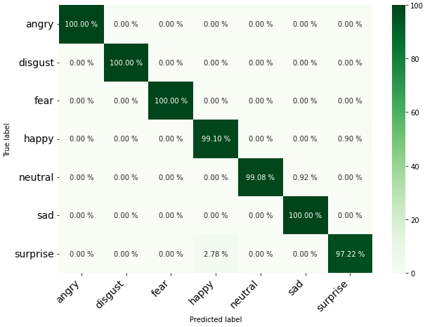
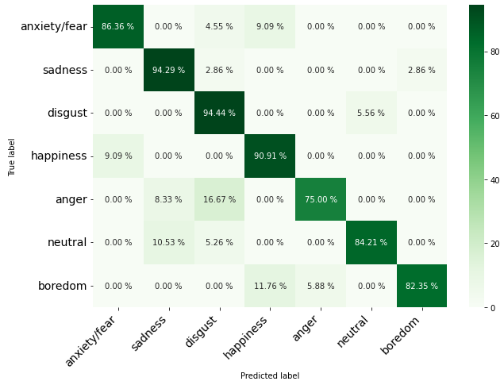

<a name="readme-top"></a>

<!-- PROJECT LOGO -->
<br />

<div align="center">
 <a href="https://github.com/alaaNfissi/Unveiling-the-Hidden-Factors-Explainable-AI-for-Feature-Boosting-in-Speech-Emotion-Recognition">
   
 </a>

 <h3 align="center">Unveiling the Hidden Factors: Explainable AI for Feature Boosting in Speech Emotion Recognition</h3>

 <p align="center">
   This paper has been submitted for publication in IEEE Transactions on Artificial Intelligence (IEEE-TAI).
   <br />
  </p>
  <a href="https://github.com/alaaNfissi/Unveiling-the-Hidden-Factors-Explainable-AI-for-Feature-Boosting-in-Speech-Emotion-Recognition"><strong>Explore the docs »</strong></a>
</div>  

<!-- TABLE OF CONTENTS -->
<details>
  <summary>Table of Contents</summary>
  <ol>
    <li><a href="#abstract">Abstract</a></li>
    <li><a href="#built-with">Built With</a></li>
    <li>
      <a href="#getting-started">Getting Started</a>
      <ul>
        <li><a href="#getting-the-code">Getting the code</a></li>
        <li><a href="#dependencies">Dependencies</a></li>
        <li><a href="#reproducing-the-results">Reproducing the results</a></li>
      </ul>
    </li>
    <li>
      <a href="#results">Results</a>
      <ul>
        <li><a href="#on-tess-and-emo-db-datasets">On TESS and EMO-DB datasets</a></li>
      </ul>
    </li>
    <li><a href="#contributing">Contributing</a></li>
    <li><a href="#license">License</a></li>
    <li><a href="#contact">Contact</a></li>
  </ol>
</details>

<!-- ABSTRACT -->
## Abstract

<p align="justify"> Speech emotion recognition (SER) has gained significant attention due to its important applications, such as mental health, education, and human-computer interaction. However, the accuracy of SER systems is hindered by high-dimensional feature sets that may contain irrelevant and redundant information, particularly challenging in complex and multidimensional speech data. To overcome this challenge, this study proposes an iterative feature boosting approach for SER that emphasizes feature relevance and explainability to enhance machine learning model performance. The approach involves meticulous feature selection and analysis to build efficient SER systems. Addressing our main problem through model explainability, a feature evaluation loop with Shapley values is used to iteratively refine feature sets, striking a balance between model performance and transparency, which enables a comprehensive understanding of the model's predictions. The proposed approach offers several advantages, including the identification and removal of irrelevant and redundant features, leading to a more effective model. Additionally, it promotes explainability, facilitating comprehension of the model's predictions and the identification of crucial features for emotion determination. The effectiveness of the proposed method is validated on widely used SER benchmarks, TESS and EMO-DB, outperforming state-of-the-art methods. These results highlight the potential of the proposed technique in developing accurate and explainable SER systems. By addressing the challenge of high-dimensional feature sets, this approach contributes to improving the accuracy and applicability of SER systems in diverse contexts. </p>
<div align="center">
  
![model-architecture][model-architecture]
  
*Proposed method diagram*
  
</div>

<!-- MARKDOWN LINKS & IMAGES -->
<!-- https://www.markdownguide.org/basic-syntax/#reference-style-links -->
[model-architecture]: images/XAI_new.png

<p align="right">(<a href="#readme-top">back to top</a>)</p>


### Built With
* 
* 
* 
* 
* 
* 
* 
* 

<p align="right">(<a href="#readme-top">back to top</a>)</p>

<!-- GETTING STARTED! -->
## Getting Started
<p align="justify">
We first set the sampling rate of the audio data to 16 KHz using a mono-channel format. This ensures that audio signals are properly processed and analyzed by our system, as most SER algorithms require specific sampling rates and number of channels for each audio signal. After going through the feature extraction and selection process, we use stratified random sampling to divide both original dataset and boosted features dataset into three homogeneous groups (or strata): training, validation, and testing. We keep 10% of the data as unseen to be used for testing, 80% for training, and 10% for validation. This ensures that the distribution of classes is maintained across all subsets. Then, we use 10- fold cross-validation to train M = 14 machine learning models: Extra Trees (et), Light Gradient Boosting Machine (lightgbm), Random Forest (rf), Quadratic Discriminant Analysis (qda), Gradient Boosting Classifier (gbc), Linear Discriminant Analysis (lda), Decision Tree (dt), Ridge (ridge), Adaptive Boosting (ada), Naive Bayes (nb), K-Nearest Neighbors (knn), Dummy classifier (dummy), Logistic Regression (lr), and Support Vector Machine (svm), on both datasets to select the optimal model for each. By using cross-validation, our performance evaluation should be less sensitive to random partitioning of data. In order to improve the performance of our best-performing machine learning models, we use the grid search technique, which involves exhaustively searching through a specified parameter space to find the best combination of hyperparameters for a given model.
In this way, we are able to fine-tune the model by adjusting its hyperparameters to increase robusteness. We thus find the optimal set of hyperparameters producing the highest performance on the validation dataset. We then assess the performance of the final models on the testing set. The testing performance is an indicator of how well the model would perform on unseen data without overfitting to the training set. Finally, we use the SHAP approach in our explainability module to evaluate the feature importance in the predictions of the optimal model. This allows us to understand how the model is making its predictions and to identify which features are most important for determining emotions. For performance evaluation, we use accuracy, recall, precision, and F1-Score metrics.
</p>

### Getting the code

You can download a copy of all the files in this repository by cloning the
[git](https://git-scm.com/) repository:

    git clone https://github.com/alaaNfissi/Unveiling-the-Hidden-Factors-Explainable-AI-for-Feature-Boosting-in-Speech-Emotion-Recognition.git

or [download a zip archive](https://github.com/alaaNfissi/Unveiling-the-Hidden-Factors-Explainable-AI-for-Feature-Boosting-in-Speech-Emotion-Recognition/archive/refs/heads/main.zip).

### Dependencies

<p align="center">

You'll need a working Python environment to run the code.
The recommended way to set up your environment is through the
[Anaconda Python distribution](https://www.anaconda.com/download/) which
provides the `conda` package manager.
Anaconda can be installed in your user directory and does not interfere with
the system Python installation.
The required dependencies are specified in the file `requirements.txt`.
We use `conda` virtual environments to manage the project dependencies in
isolation.
Thus, you can install our dependencies without causing conflicts with your
setup (even with different Python versions).
Run the following command to create an `ser-env` environment to create a separate environment:
```sh 
    conda create --name ser-env
```
Activate the environment, this will enable the it for your current terminal session. Any subsequent commands will use software that is installed in the environment:
```sh 
    conda activate ser-env
 ``` 
Use Pip to install packages to Anaconda Environment:
```sh 
    conda install pip
```
Install all required dependencies in it:
```sh
    pip install -r requirements.txt
```
  
</p>

### Reproducing the results

<p align="center">  
  
1. First, you need to download TESS and EMO-DB datasets:
  * [TESS official website](https://tspace.library.utoronto.ca/handle/1807/24487)
  * [EMO-DB official website](http://emodb.bilderbar.info/start.html)
  
2. TESS as an example: To be able to explore the data you need to execute the Jupyter notebook that prepares the `csv` files needed for the experiments.
To do this, you must first start the notebook server by going into the
repository top level and running:
```sh 
    jupyter notebook
```
This will start the server and open your default web browser to the Jupyter
interface. In the page, go into the `Data_exploration` folder and select the
`data_exploration.ipynb` notebook to view/run. Make sure to specify the correct datasets paths on your own machine as described in the notebook.
The notebook is divided into cells (some have text while other have code).
Each cell can be executed using `Shift + Enter`.
Executing text cells does nothing and executing code cells runs the code
and produces it's output.
To execute the whole notebook, run all cells in order.
 
3. After generating the needed `csv` file `TESS_dataset.csv`, go to your terminal where the `ser-env` environment was
  activated and go to `SER` folder and run the python script. For example:
```sh  
python ser.py
``` 

</p>

<p align="right">(<a href="#readme-top">back to top</a>)</p>

## Results
### On TESS and EMO-DB datasets
<p align="center"> 
  
A comparison of the performance of several machine learning models was conducted using a dataset that underwent feature boosting and the incorporation of an XAI feedback loop. The best-performing model on both datasets, TESS and EMO-DB, was the Extra Trees (ET) classifier, which achieved an accuracy of 99.4% and F1-score of 99.4% on TESS and an accuracy of 88.3% and F1-score of 87.4% on EMO-DB. The second best-performing model was Light GBM with an accuracy and F1-score of 99% on TESS and an accuracy of 73.8% and F1-score of 70.5% on EMO-DB. The results of the Extra Trees classifier on both datasets were evaluated through a confusion matrices, which show that it performs well overall.

</p>

TESS Confusion matrix            |  EMO-DB Confusion matrix 
:-------------------------------:|:-----------------------------:
   |  

 
<p align="right">(<a href="#readme-top">back to top</a>)</p>

<p align="center">
  
_For more detailed experiments and results you can read the paper._
  
</p>

<!-- CONTRIBUTING -->
## Contributing

Contributions are what make the open source community such an amazing place to learn, inspire, and create. Any contributions you make are **greatly appreciated**.

If you have a suggestion that would make this better, please fork the repo and create a pull request. You can also simply open an issue with the tag "enhancement".
Don't forget to give the project a star! Thanks again!

1. Fork the Project
2. Create your Feature Branch (`git checkout -b feature/AmazingFeature`)
3. Commit your Changes (`git commit -m 'Add some AmazingFeature'`)
4. Push to the Branch (`git push origin feature/AmazingFeature`)
5. Open a Pull Request

<p align="right">(<a href="#readme-top">back to top</a>)</p>


<!-- LICENSE -->
## License

All source code is made available under a BSD 3-clause license. You can freely
use and modify the code, without warranty, so long as you provide attribution
to the authors. See `LICENSE` for the full license text.

<p align="right">(<a href="#readme-top">back to top</a>)</p>
